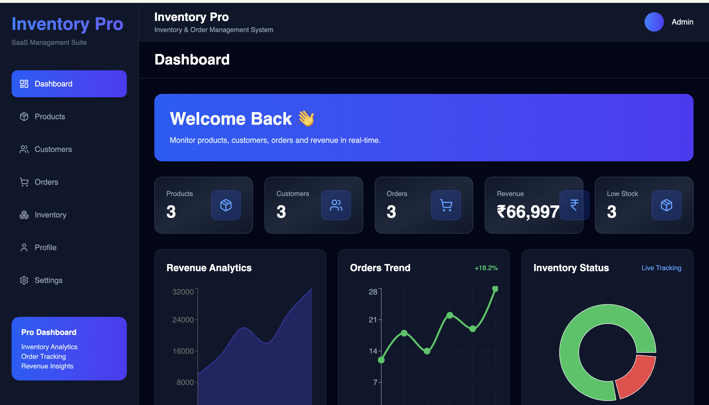
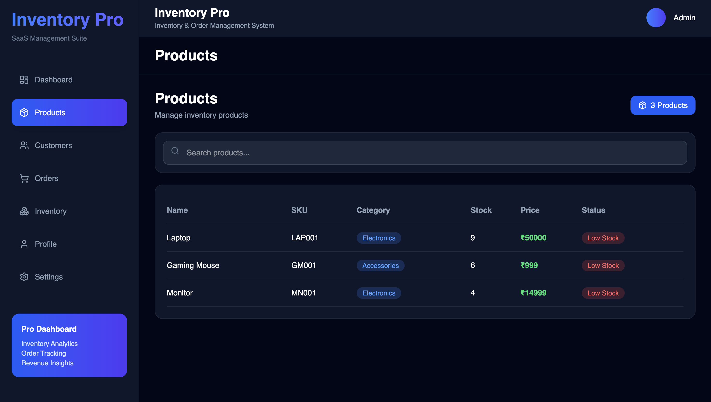
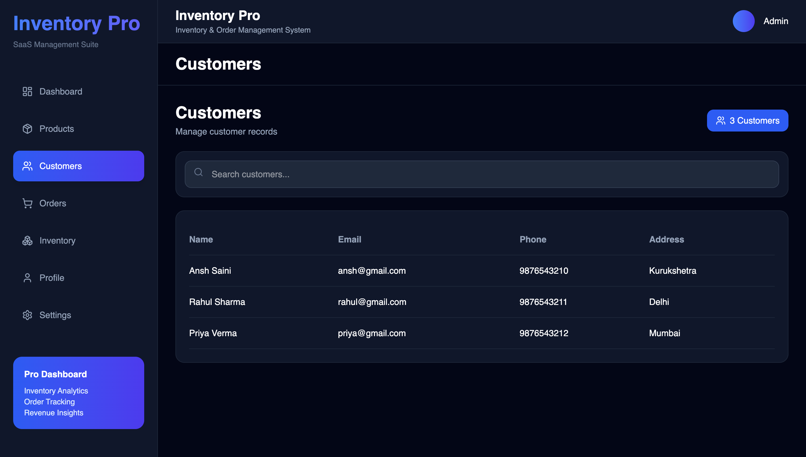
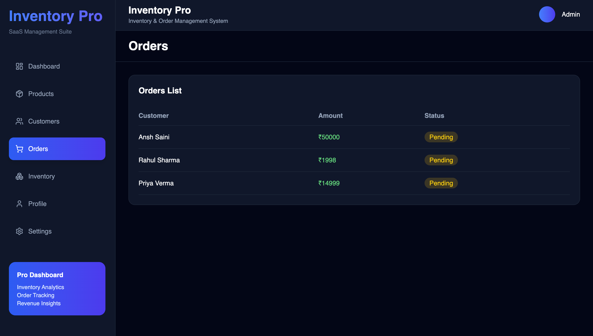
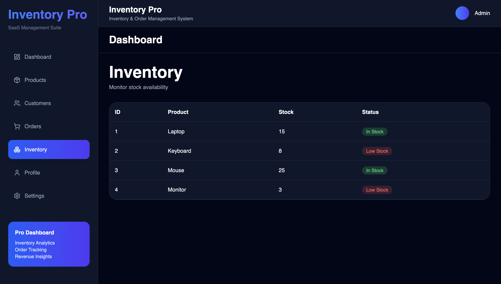
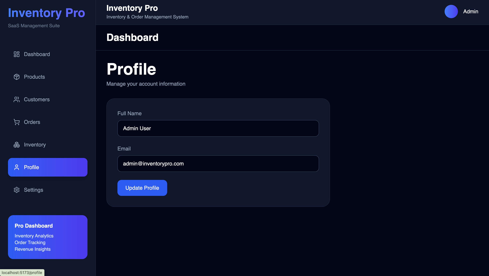
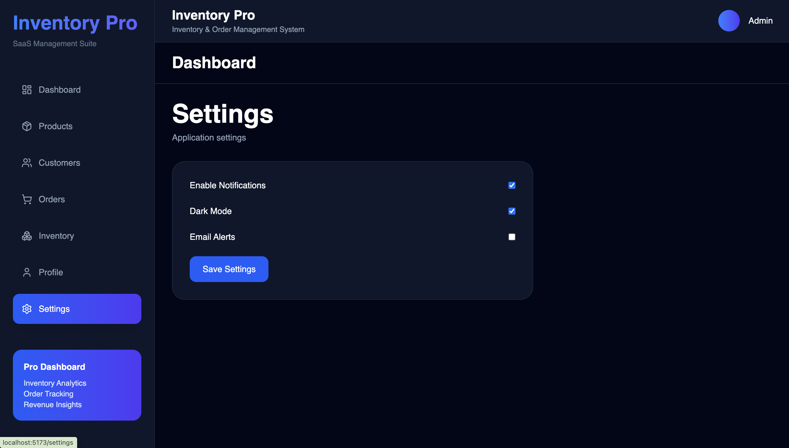

# Inventory Pro

A modern SaaS-style Inventory & Order Management System built using React, TypeScript, Express.js, MongoDB, and Tailwind CSS.

## Live Demo

### Frontend Application (Vercel)

https://inventory-order-management-system-inky-kappa.vercel.app

### Backend API (Render)

https://inventory-order-management-system-9buf.onrender.com

### GitHub Repository

https://github.com/sainiansh3004/inventory-order-management-system

### Docker Hub Backend Image

https://hub.docker.com/r/sainiansh3004/inventory-backend

---

## Docker Setup

### Pull Docker Image

```bash
docker pull sainiansh3004/inventory-backend:latest
```

### Run Docker Container

```bash
docker run -p 5001:5001 sainiansh3004/inventory-backend:latest
```

### Verify

Open:

http://localhost:5001

Expected Response:

```text
Inventory API Running
```

---

## Overview

Inventory Pro helps businesses efficiently manage:

* Products
* Customers
* Orders
* Revenue
* Inventory Levels

The system provides real-time analytics through an interactive dashboard.

---

## Features

### Dashboard

* Total Products
* Total Customers
* Total Orders
* Revenue Analytics
* Inventory Status
* Low Stock Alerts

### Product Management

* Add Products
* View Products
* Inventory Tracking
* Stock Monitoring

### Customer Management

* Add Customers
* View Customer Details
* Manage Customer Records

### Order Management

* Create Orders
* Track Orders
* Revenue Calculation
* Automatic Inventory Update

### Inventory Monitoring

* Low Stock Detection
* Real-Time Quantity Updates

---

## Tech Stack

### Frontend

* React
* TypeScript
* Vite
* Tailwind CSS
* Axios
* React Router
* Recharts
* Lucide React

### Backend

* Node.js
* Express.js
* MongoDB
* Mongoose

### Deployment

* Vercel
* Render
* Docker Hub

---

## Project Structure

```text
inventory-order-management-system

├── backend
│   ├── controllers
│   ├── models
│   ├── routes
│   ├── middleware
│   └── server.js
│
├── frontend
│   ├── src
│   │   ├── components
│   │   ├── pages
│   │   ├── services
│   │   └── App.tsx
│
├── README.md
├── package.json
└── package-lock.json
```

---

## Installation

### Backend Setup

```bash
cd backend
npm install
node server.js
```

### Frontend Setup

```bash
cd frontend
npm install
npm run dev
```

---

## API Endpoints

### Products

* GET /api/products
* POST /api/products
* PUT /api/products/:id
* DELETE /api/products/:id

### Customers

* GET /api/customers
* POST /api/customers
* PUT /api/customers/:id
* DELETE /api/customers/:id

### Orders

* GET /api/orders
* POST /api/orders

### Dashboard

* GET /api/dashboard/stats

---

## Implemented Features

* Dashboard Analytics
* Product Management
* Customer Management
* Order Management
* Revenue Tracking
* Inventory Tracking
* MongoDB Integration
* Responsive SaaS Dashboard UI
* Dockerized Backend
* Cloud Deployment

---

## Author

**Ansh Saini**

Inventory Pro – Inventory & Order Management System

---

## Application Screenshots

### Dashboard



### Products



### Customers



### Orders



### Inventory



### Profile



### Settings



---

## Deployment Resources

| Resource          | Link                                                               |
| ----------------- | ------------------------------------------------------------------ |
| Frontend (Vercel) | https://inventory-order-management-system-inky-kappa.vercel.app    |
| Backend (Render)  | https://inventory-order-management-system-9buf.onrender.com        |
| Docker Hub        | https://hub.docker.com/r/sainiansh3004/inventory-backend           |
| GitHub Repository | https://github.com/sainiansh3004/inventory-order-management-system |

---

## License

This project is developed for educational, learning, and assessment purposes.
